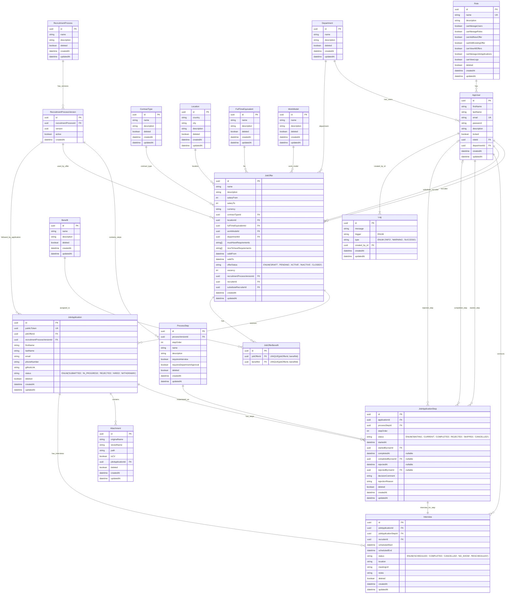

# Mermaid schema of database

```mermaid
    erDiagram
    AppUser {
        uuid id PK
        string firstName
        string lastName
        string email UK
        string password
        string description
        boolean locked
        uuid roleId FK
        uuid departmentId FK
        datetime createdAt
        datetime updatedAt
    }

    Role {
        uuid id PK
        string name UK
        string description
        boolean canManageUsers
        boolean canManageRoles
        boolean canAddNewOffer
        boolean canEditExistingOffer
        boolean canViewAllOffers
        boolean canManageJobApplications
        boolean canViewLogs
        boolean deleted
        datetime createdAt
        datetime updatedAt
    }

    Department {
        uuid id PK
        string name
        string description
        boolean deleted
        datetime createdAt
        datetime updatedAt
    }

    JobOffer {
        uuid id PK
        string name
        string description
        int salaryFrom
        int salaryTo
        string currency
        uuid contractTypeId FK
        uuid locationId FK
        uuid fullTimeEquivalentId FK
        uuid workModelId FK
        uuid departmentId FK
        string[] mustHaveRequirements
        string[] niceToHaveRequirements
        datetime validFrom
        datetime validTo
        string offerStatus "ENUM('DRAFT', 'PENDING', 'ACTIVE', 'INACTIVE', 'CLOSED')"
        int vacancy
        uuid recruitmentProcessVersionId FK
        uuid recruiterId FK
        uuid substituteRecruiterId FK
        datetime createdAt
        datetime updatedAt
    }

    ContractType {
        uuid id PK
        string name
        string description
        boolean deleted
        datetime createdAt
        datetime updatedAt
    }

    Location {
        uuid id PK
        string country
        string city
        string description
        boolean deleted
        datetime createdAt
        datetime updatedAt
    }

    FullTimeEquivalent {
        uuid id PK
        string name
        string description
        boolean deleted
        datetime createdAt
        datetime updatedAt
    }

    WorkModel {
        uuid id PK
        string name
        string description
        boolean deleted
        datetime createdAt
        datetime updatedAt
    }

    Benefit {
        uuid id PK
        string name
        string description
        boolean deleted
        datetime createdAt
        datetime updatedAt
    }

    JobOfferBenefit {
        uuid id PK
        uuid jobOfferId FK "UNIQUE(jobOfferId, benefitId)"
        uuid benefitId FK "UNIQUE(jobOfferId, benefitId)"
    }

    RecruitmentProcess {
        uuid id PK
        string name
        string description
        boolean deleted
        datetime createdAt
        datetime updatedAt
    }

    RecruitmentProcessVersion {
        uuid id PK
        uuid recruitmentProcessId FK
        uuid version
        boolean active
        datetime createdAt
    }

    ProcessStep {
        uuid id PK
        uuid processVersionId FK
        int stepOrder
        string name
        string description
        boolean requiresInterview
        boolean requiresDepartmentApproval
        boolean deleted
        datetime createdAt
        datetime updatedAt
    }

    JobApplication {
        uuid id PK
        uuid publicToken UK
        uuid jobOfferId FK
        uuid recruitmentProcessVersionId FK
        string firstName
        string lastName
        string email
        string phoneNumber
        string githubLink
        string status "ENUM('SUBMITTED', 'IN_PROGRESS', 'REJECTED', 'HIRED', 'WITHDRAWN')"
        boolean deleted
        datetime createdAt
        datetime updatedAt
    }

    JobApplicationStep {
        uuid id PK
        uuid applicationId FK
        uuid processStepId FK
        int stepOrder
        string status "ENUM('WAITING', 'CURRENT', 'COMPLETED', 'REJECTED', 'SKIPPED', 'CANCELLED')"
        datetime startedAt
        uuid startedByUserId FK
        datetime completedAt "nullable"
        uuid completedByUserId FK "nullable"
        datetime rejectedAt "nullable"
        uuid rejectedByUserId FK "nullable"
        string decisionComment
        string rejectionReason
        boolean deleted
        datetime createdAt
        datetime updatedAt
    }

    Interview {
        uuid id PK
        uuid jobApplicationId FK
        uuid jobApplicationStepId FK
        uuid recruiterId FK
        datetime scheduledStart
        datetime scheduledEnd
        string status "ENUM('SCHEDULED', 'COMPLETED', 'CANCELLED', 'NO_SHOW', 'RESCHEDULED')"
        string location
        string meetingUrl
        string notes
        boolean deleted
        datetime createdAt
        datetime updatedAt
    }

    Attachment {
        uuid id PK
        string originalName
        string storedName
        string path
        boolean isCV
        uuid jobApplicationId FK
        boolean deleted
        datetime createdAt
        datetime updatedAt
    }

    Log {
        uuid id PK
        string message
        string trigger "ENUM"
        string type "ENUM ('INFO', 'WARNING', 'SUCCESS')"
        uuid created_by_id FK
        datetime createdAt
        datetime updatedAt
    }

%% Relacje użytkowników, ról i działów

    Role ||--o{ AppUser : has
    Department ||--o{ AppUser : has_users

    AppUser ||--o{ JobOffer : recruiter
    AppUser ||--o{ JobOffer : substitute_recruiter

    AppUser ||--o{ Interview : conducts

    AppUser ||--o{ JobApplicationStep : started_step
    AppUser |o--o{ JobApplicationStep : completed_step
    AppUser |o--o{ JobApplicationStep : rejected_step
    
    AppUser ||--|{ Log : created_by_id

%% Relacje ofert pracy

    ContractType ||--o{ JobOffer : contract_type
    Department ||--o{ JobOffer : department
    Location ||--o{ JobOffer : location
    FullTimeEquivalent ||--o{ JobOffer : fte
    WorkModel ||--o{ JobOffer : work_model

    JobOffer ||--o{ JobApplication : receives

    JobOffer ||--o{ JobOfferBenefit : has
    Benefit ||--o{ JobOfferBenefit : assigned_to

%% Relacje procesu rekrutacyjnego

    RecruitmentProcess ||--o{ RecruitmentProcessVersion : has_versions
    RecruitmentProcessVersion ||--o{ ProcessStep : contains_steps

    RecruitmentProcessVersion ||--o{ JobOffer : used_by_offer
    RecruitmentProcessVersion ||--o{ JobApplication : followed_by_application

%% Relacje aplikacji kandydata

    JobApplication ||--o{ JobApplicationStep : has_steps
    ProcessStep ||--o{ JobApplicationStep : instantiated_as

    JobApplication ||--o{ Attachment : contains

    JobApplication ||--o{ Interview : has_interviews
    JobApplicationStep ||--|| Interview : interview_for_step
```