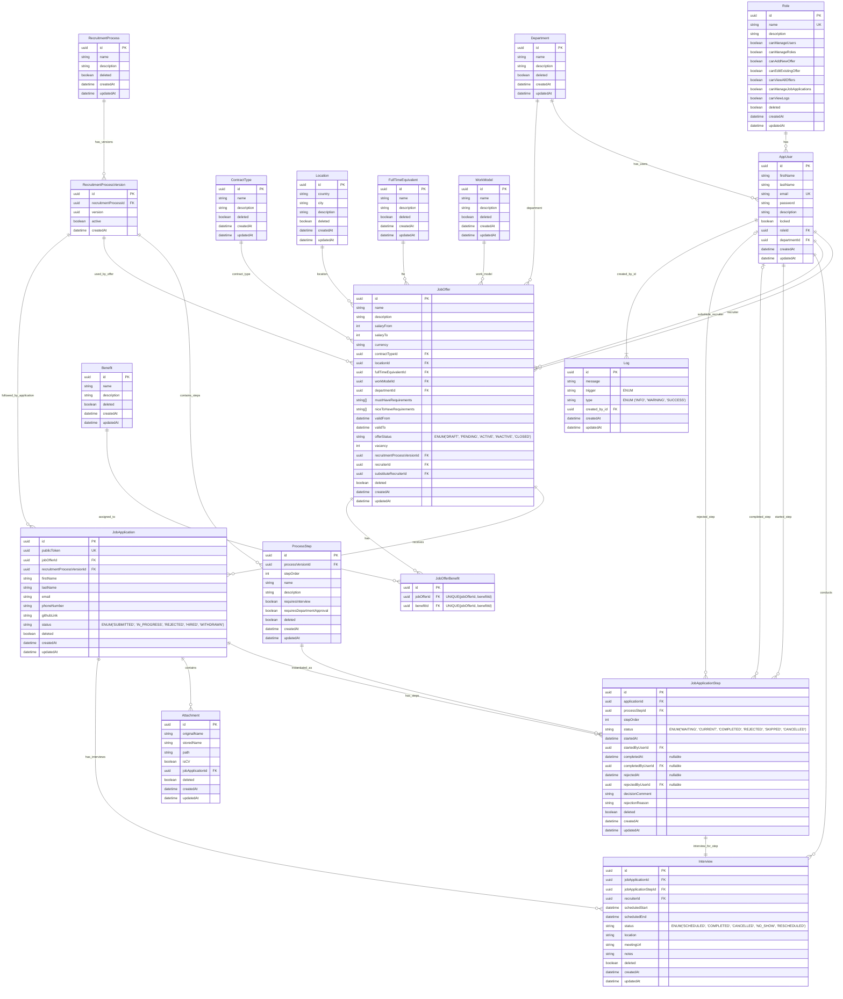

# recruitment-system-v3-api



Project structure
```
src
└── main
    ├── java
    │   └── com
    │       └── example
    │           └── recruitmentsystem
    │               ├── RecruitmentSystemApplication.java
    │               │
    │               ├── auth
    │               │   ├── controller
    │               │   │   └── AuthController.java
    │               │   ├── dto
    │               │   │   ├── LoginRequest.java
    │               │   │   ├── LoginResponse.java
    │               │   │   └── RefreshTokenRequest.java
    │               │   ├── service
    │               │   │   ├── AuthService.java
    │               │   │   └── JwtService.java
    │               │   └── security
    │               │       ├── JwtAuthenticationFilter.java
    │               │       ├── CustomUserDetailsService.java
    │               │       └── SecurityUser.java
    │               │
    │               ├── user
    │               │   ├── controller
    │               │   │   └── UserController.java
    │               │   ├── dto
    │               │   │   ├── CreateUserRequest.java
    │               │   │   ├── UpdateUserRequest.java
    │               │   │   └── UserResponse.java
    │               │   ├── mapper
    │               │   │   └── UserMapper.java
    │               │   ├── model
    │               │   │   └── User.java
    │               │   ├── repository
    │               │   │   └── UserRepository.java
    │               │   └── service
    │               │       └── UserService.java
    │               │
    │               ├── role
    │               │   ├── controller
    │               │   │   └── RoleController.java
    │               │   ├── dto
    │               │   │   ├── CreateRoleRequest.java
    │               │   │   ├── UpdateRoleRequest.java
    │               │   │   └── RoleResponse.java
    │               │   ├── mapper
    │               │   │   └── RoleMapper.java
    │               │   ├── model
    │               │   │   └── Role.java
    │               │   ├── repository
    │               │   │   └── RoleRepository.java
    │               │   └── service
    │               │       └── RoleService.java
    │               │
    │               ├── joboffer
    │               │   ├── controller
    │               │   │   ├── JobOfferController.java
    │               │   │   └── PublicJobOfferController.java
    │               │   ├── dto
    │               │   │   ├── CreateJobOfferRequest.java
    │               │   │   ├── UpdateJobOfferRequest.java
    │               │   │   ├── PublishJobOfferRequest.java
    │               │   │   ├── JobOfferResponse.java
    │               │   │   ├── JobOfferListItemResponse.java
    │               │   │   └── JobOfferDetailsResponse.java
    │               │   ├── mapper
    │               │   │   └── JobOfferMapper.java
    │               │   ├── model
    │               │   │   ├── JobOffer.java
    │               │   │   ├── JobOfferBenefit.java
    │               │   │   └── JobOfferStatus.java
    │               │   ├── repository
    │               │   │   ├── JobOfferRepository.java
    │               │   │   └── JobOfferBenefitRepository.java
    │               │   └── service
    │               │       ├── JobOfferService.java
    │               │       ├── JobOfferPublishingService.java
    │               │       └── PublicJobOfferService.java
    │               │
    │               ├── recruitmentprocess
    │               │   ├── controller
    │               │   │   └── RecruitmentProcessController.java
    │               │   ├── dto
    │               │   │   ├── CreateRecruitmentProcessRequest.java
    │               │   │   ├── UpdateRecruitmentProcessRequest.java
    │               │   │   ├── CreateProcessStepRequest.java
    │               │   │   ├── RecruitmentProcessResponse.java
    │               │   │   ├── RecruitmentProcessVersionResponse.java
    │               │   │   └── ProcessStepResponse.java
    │               │   ├── mapper
    │               │   │   ├── RecruitmentProcessMapper.java
    │               │   │   └── ProcessStepMapper.java
    │               │   ├── model
    │               │   │   ├── RecruitmentProcess.java
    │               │   │   ├── RecruitmentProcessVersion.java
    │               │   │   └── ProcessStep.java
    │               │   ├── repository
    │               │   │   ├── RecruitmentProcessRepository.java
    │               │   │   ├── RecruitmentProcessVersionRepository.java
    │               │   │   └── ProcessStepRepository.java
    │               │   └── service
    │               │       ├── RecruitmentProcessService.java
    │               │       ├── RecruitmentProcessVersionService.java
    │               │       └── ProcessStepService.java
    │               │
    │               ├── jobapplication
    │               │   ├── controller
    │               │   │   ├── JobApplicationController.java
    │               │   │   └── PublicApplicationStatusController.java
    │               │   ├── dto
    │               │   │   ├── CreateJobApplicationRequest.java
    │               │   │   ├── ApplicationStatusLookupRequest.java
    │               │   │   ├── JobApplicationResponse.java
    │               │   │   ├── JobApplicationListItemResponse.java
    │               │   │   ├── ApplicationStatusResponse.java
    │               │   │   ├── ChangeApplicationStepRequest.java
    │               │   │   └── JobApplicationStepResponse.java
    │               │   ├── mapper
    │               │   │   ├── JobApplicationMapper.java
    │               │   │   └── JobApplicationStepMapper.java
    │               │   ├── model
    │               │   │   ├── JobApplication.java
    │               │   │   ├── JobApplicationStatus.java
    │               │   │   ├── JobApplicationStep.java
    │               │   │   └── JobApplicationStepStatus.java
    │               │   ├── repository
    │               │   │   ├── JobApplicationRepository.java
    │               │   │   └── JobApplicationStepRepository.java
    │               │   └── service
    │               │       ├── JobApplicationService.java
    │               │       ├── JobApplicationStepService.java
    │               │       ├── ApplicationStatusService.java
    │               │       └── ApplicationSubmissionService.java
    │               │
    │               ├── interview
    │               │   ├── controller
    │               │   │   └── InterviewController.java
    │               │   ├── dto
    │               │   │   ├── CreateInterviewRequest.java
    │               │   │   ├── UpdateInterviewRequest.java
    │               │   │   └── InterviewResponse.java
    │               │   ├── mapper
    │               │   │   └── InterviewMapper.java
    │               │   ├── model
    │               │   │   ├── Interview.java
    │               │   │   └── InterviewStatus.java
    │               │   ├── repository
    │               │   │   └── InterviewRepository.java
    │               │   └── service
    │               │       └── InterviewService.java
    │               │
    │               ├── attachment
    │               │   ├── controller
    │               │   │   └── AttachmentController.java
    │               │   ├── dto
    │               │   │   └── AttachmentResponse.java
    │               │   ├── mapper
    │               │   │   └── AttachmentMapper.java
    │               │   ├── model
    │               │   │   └── Attachment.java
    │               │   ├── repository
    │               │   │   └── AttachmentRepository.java
    │               │   ├── service
    │               │   │   ├── AttachmentService.java
    │               │   │   └── FileStorageService.java
    │               │   └── validator
    │               │       └── AttachmentValidator.java
    │               │
    │               ├── dictionary
    │               │   ├── controller
    │               │   │   ├── ContractTypeController.java
    │               │   │   ├── LocationController.java
    │               │   │   ├── FullTimeEquivalentController.java
    │               │   │   ├── WorkModelController.java
    │               │   │   └── BenefitController.java
    │               │   ├── dto
    │               │   │   ├── DictionaryItemRequest.java
    │               │   │   ├── DictionaryItemResponse.java
    │               │   │   └── LocationResponse.java
    │               │   ├── mapper
    │               │   │   └── DictionaryMapper.java
    │               │   ├── model
    │               │   │   ├── ContractType.java
    │               │   │   ├── Location.java
    │               │   │   ├── FullTimeEquivalent.java
    │               │   │   ├── WorkModel.java
    │               │   │   └── Benefit.java
    │               │   ├── repository
    │               │   │   ├── ContractTypeRepository.java
    │               │   │   ├── LocationRepository.java
    │               │   │   ├── FullTimeEquivalentRepository.java
    │               │   │   ├── WorkModelRepository.java
    │               │   │   └── BenefitRepository.java
    │               │   └── service
    │               │       ├── ContractTypeService.java
    │               │       ├── LocationService.java
    │               │       ├── FullTimeEquivalentService.java
    │               │       ├── WorkModelService.java
    │               │       └── BenefitService.java
    │               │
    │               ├── log
    │               │   ├── controller
    │               │   │   └── LogController.java
    │               │   ├── dto
    │               │   │   └── LogResponse.java
    │               │   ├── mapper
    │               │   │   └── LogMapper.java
    │               │   ├── model
    │               │   │   └── Log.java
    │               │   ├── repository
    │               │   │   └── LogRepository.java
    │               │   └── service
    │               │       └── LogService.java
    │               │
    │               ├── dashboard
    │               │   ├── controller
    │               │   │   └── DashboardController.java
    │               │   ├── dto
    │               │   │   ├── RecruiterDashboardResponse.java
    │               │   │   ├── AdminDashboardResponse.java
    │               │   │   └── ApplicationsChartResponse.java
    │               │   └── service
    │               │       └── DashboardService.java
    │               │
    │               ├── notification
    │               │   ├── dto
    │               │   │   └── EmailMessage.java
    │               │   ├── model
    │               │   │   └── EmailTemplate.java
    │               │   ├── repository
    │               │   │   └── EmailTemplateRepository.java
    │               │   └── service
    │               │       ├── EmailService.java
    │               │       ├── EmailTemplateService.java
    │               │       └── ApplicationNotificationService.java
    │               │
    │               ├── config
    │               │   ├── OpenApiConfig.java
    │               │   ├── SecurityConfig.java
    │               │   ├── CorsConfig.java
    │               │   ├── JpaConfig.java
    │               │   └── MailConfig.java
    │               │
    │               ├── common
    │               │   ├── exception
    │               │   │   ├── GlobalExceptionHandler.java
    │               │   │   ├── NotFoundException.java
    │               │   │   ├── BadRequestException.java
    │               │   │   ├── ForbiddenException.java
    │               │   │   └── ErrorResponse.java
    │               │   ├── pagination
    │               │   │   └── PageResponse.java
    │               │   ├── validation
    │               │   │   ├── ValidationConstants.java
    │               │   │   └── ValidFile.java
    │               │   ├── util
    │               │   │   ├── TokenGenerator.java
    │               │   │   └── DateTimeProvider.java
    │               │   └── audit
    │               │       └── AuditableEntity.java
    │               │
    │               └── seed
    │                   └── SuperAdminSeeder.java
    │
    └── resources
        ├── application.yml
        ├── application-dev.yml
        ├── application-prod.yml
        ├── db
        │   └── migration
        │       ├── V1__init_schema.sql
        │       ├── V2__seed_roles.sql
        │       ├── V3__seed_super_admin.sql
        │       └── V4__seed_dictionaries.sql
        └── templates
            └── email
                ├── application-submitted.html
                ├── application-status-changed.html
                ├── interview-scheduled.html
                └── application-rejected.html
```