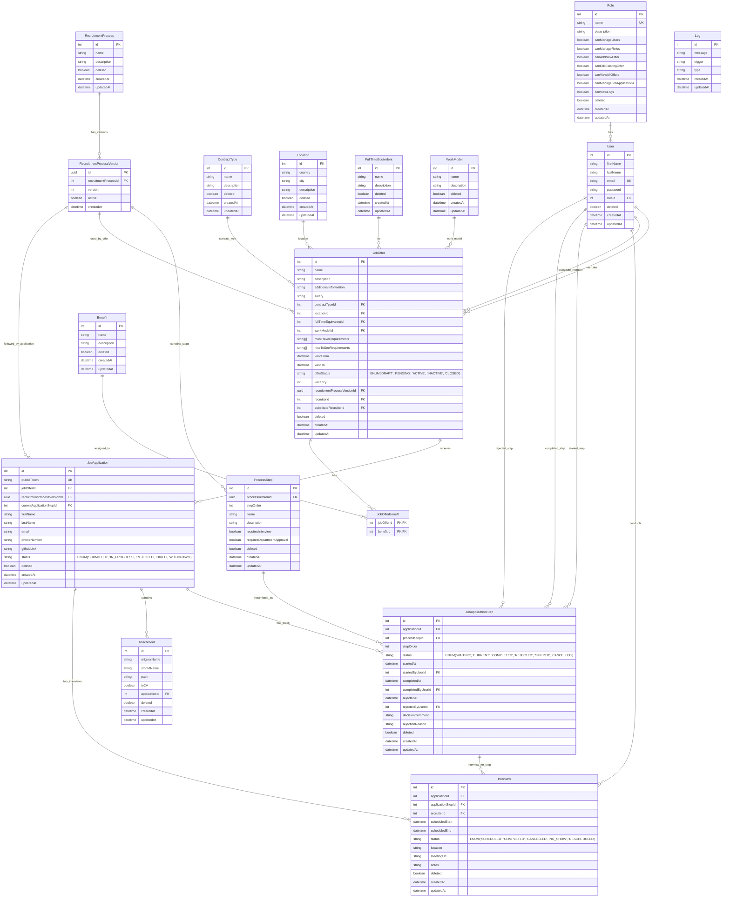

# recruitment-system-v3-api

```mermaid
    erDiagram
    User {
        int id PK
        string firstName
        string lastName
        string email UK
        string password
        int roleId FK
        boolean deleted
        datetime createdAt
        datetime updatedAt
    }

    Role {
        int id PK
        string name UK
        string description
        boolean canManageUsers
        boolean canManageRoles
        boolean canAddNewOffer
        boolean canEditExistingOffer
        boolean canViewAllOffers
        boolean canManageJobApplications
        boolean canViewLogs
        boolean deleted
        datetime createdAt
        datetime updatedAt
    }

    JobOffer {
        int id PK
        string name
        string description
        string additionalInformation
        string salary
        int contractTypeId FK
        int locationId FK
        int fullTimeEquivalentId FK
        int workModelId FK
        string[] mustHaveRequirements
        string[] niceToSeeRequirements
        datetime validFrom
        datetime validTo
        string offerStatus "ENUM('DRAFT', 'PENDING', 'ACTIVE', 'INACTIVE', 'CLOSED')"
        int vacancy
        uuid recruitmentProcessVersionId FK
        int recruiterId FK
        int substituteRecruiterId FK
        boolean deleted
        datetime createdAt
        datetime updatedAt
    }

    ContractType {
        int id PK
        string name
        string description
        boolean deleted
        datetime createdAt
        datetime updatedAt
    }

    Location {
        int id PK
        string country
        string city
        string description
        boolean deleted
        datetime createdAt
        datetime updatedAt
    }

    FullTimeEquivalent {
        int id PK
        string name
        string description
        boolean deleted
        datetime createdAt
        datetime updatedAt
    }

    WorkModel {
        int id PK
        string name
        string description
        boolean deleted
        datetime createdAt
        datetime updatedAt
    }

    Benefit {
        int id PK
        string name
        string description
        boolean deleted
        datetime createdAt
        datetime updatedAt
    }

    JobOfferBenefit {
        int jobOfferId PK,FK
        int benefitId PK,FK
    }

    RecruitmentProcess {
        int id PK
        string name
        string description
        boolean deleted
        datetime createdAt
        datetime updatedAt
    }

    RecruitmentProcessVersion {
        uuid id PK
        int recruitmentProcessId FK
        int version
        boolean active
        datetime createdAt
    }

    ProcessStep {
        int id PK
        uuid processVersionId FK
        int stepOrder
        string name
        string description
        boolean requiresInterview
        boolean requiresDepartmentApproval
        boolean deleted
        datetime createdAt
        datetime updatedAt
    }

    JobApplication {
        int id PK
        string publicToken UK
        int jobOfferId FK
        uuid recruitmentProcessVersionId FK
        int currentApplicationStepId FK
        string firstName
        string lastName
        string email
        string phoneNumber
        string githubLink
        string status "ENUM('SUBMITTED', 'IN_PROGRESS', 'REJECTED', 'HIRED', 'WITHDRAWN')"
        boolean deleted
        datetime createdAt
        datetime updatedAt
    }

    JobApplicationStep {
        int id PK
        int applicationId FK
        int processStepId FK
        int stepOrder
        string status "ENUM('WAITING', 'CURRENT', 'COMPLETED', 'REJECTED', 'SKIPPED', 'CANCELLED')"
        datetime startedAt
        int startedByUserId FK
        datetime completedAt
        int completedByUserId FK
        datetime rejectedAt
        int rejectedByUserId FK
        string decisionComment
        string rejectionReason
        boolean deleted
        datetime createdAt
        datetime updatedAt
    }

    Interview {
        int id PK
        int applicationId FK
        int applicationStepId FK
        int recruiterId FK
        datetime scheduledStart
        datetime scheduledEnd
        string status "ENUM('SCHEDULED', 'COMPLETED', 'CANCELLED', 'NO_SHOW', 'RESCHEDULED')"
        string location
        string meetingUrl
        string notes
        boolean deleted
        datetime createdAt
        datetime updatedAt
    }

    Attachment {
        int id PK
        string originalName
        string storedName
        string path
        boolean isCV
        int applicationId FK
        boolean deleted
        datetime createdAt
        datetime updatedAt
    }

    Log {
        int id PK
        string message
        string trigger
        string type
        datetime createdAt
        datetime updatedAt
    }

    %% Relacje użytkowników i ról

    Role ||--o{ User : has

    User ||--o{ JobOffer : recruiter
    User ||--o{ JobOffer : substitute_recruiter

    User ||--o{ Interview : conducts

    User ||--o{ JobApplicationStep : started_step
    User ||--o{ JobApplicationStep : completed_step
    User ||--o{ JobApplicationStep : rejected_step

    %% Relacje ofert pracy

    ContractType ||--o{ JobOffer : contract_type
    Location ||--o{ JobOffer : location
    FullTimeEquivalent ||--o{ JobOffer : fte
    WorkModel ||--o{ JobOffer : work_model

    JobOffer ||--o{ JobApplication : receives

    JobOffer ||--o{ JobOfferBenefit : has
    Benefit ||--o{ JobOfferBenefit : assigned_to

    %% Relacje procesu rekrutacyjnego

    RecruitmentProcess ||--o{ RecruitmentProcessVersion : has_versions
    RecruitmentProcessVersion ||--o{ ProcessStep : contains_steps

    RecruitmentProcessVersion ||--o{ JobOffer : used_by_offer
    RecruitmentProcessVersion ||--o{ JobApplication : followed_by_application

    %% Relacje aplikacji kandydata

    JobApplication ||--o{ JobApplicationStep : has_steps
    ProcessStep ||--o{ JobApplicationStep : instantiated_as

    JobApplication ||--o{ Attachment : contains

    JobApplication ||--o{ Interview : has_interviews
    JobApplicationStep ||--o{ Interview : interview_for_step
```